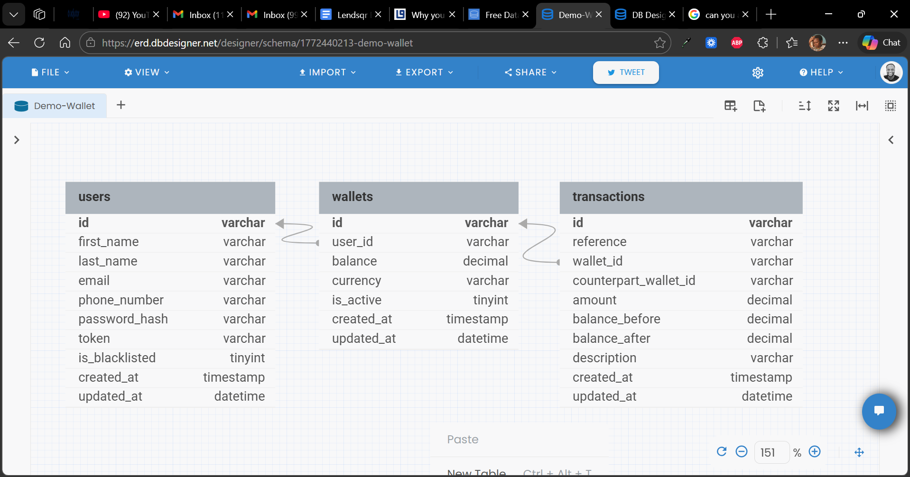

# Demo Credit — Wallet Service MVP

A wallet service. Users can create accounts, fund wallets, transfer funds to other users, and withdraw — with automatic Karma blacklist protection via the Lendsqr Adjutor API.

---

## Tech Stack


 Runtime: Node.js LTS (v20+) 
 Language: TypeScript 5 
 Framework : Express 4 
 ORM :KnexJS 
 Database :MySQL 8 
 Validation : Joi 
 Testing : Jest + ts-jest 
 Auth : Faux token (no JWT) 

---

## Architecture

The application follows a **3-layer module architecture**:

```
Controller:  thin HTTP layer (validates, calls service, sends response)
Service:       all business logic, transaction coordination, domain errors
Repository:  pure Knex queries, optional trx parameter for transaction support
```

Modules are organized by domain (users, wallets, transactions) rather than by layer. All dependencies are wired through constructor injection via `src/config/container.ts`.

---

## E-R Diagram



```
Relationships:
  users      (1) ──── (1) wallets
  wallets    (1) ──── (*) transactions  [as primary wallet]
  wallets    (1) ──── (*) transactions  [as counterpart_wallet, nullable]
```


---

## API Reference
Swagger documentation used also, but the reference is below.

**Base URL**: `http://localhost:3000/api/v1`

All responses use the envelope:
```json
{ "status": "success|error", "message": "...", "data": {} }
```

### Users

#### `POST /users` — Register
```json
// Request
{
  "first_name": "John",
  "last_name": "Doe",
  "email": "john.doe@example.com",
  "phone_number": "+2348012345678",
  "password": "SecurePass123"
}

// 201 Created
{
  "status": "success",
  "message": "Account created successfully.",
  "data": {
    "user": { "id": "...", "first_name": "John", "email": "john.doe@example.com" },
    "wallet": { "id": "...", "balance": "0.00", "currency": "NGN" },
    "token": "base64userId.randomhex"
  }
}

// 403 Forbidden (blacklisted)
{ "status": "error", "message": "...", "error_code": "USER_BLACKLISTED" }
```

#### `POST /users/login` — Login
```json
// Request
{ "email": "john.doe@example.com", "password": "SecurePass123" }

// 200 OK
{ "status": "success", "data": { "token": "...", "user": { ... } } }
```

#### `GET /users/me` — Profile (auth required)
```
Authorization: Bearer <token>
```

---

### Wallets (all require `Authorization: Bearer <token>`)

#### `GET /wallets/me` — Get Balance

#### `POST /wallets/fund` — Fund Wallet
```json
{ "amount": 5000.00, "reference": "FND-001" }
```

#### `POST /wallets/transfer` — Transfer
```json
{
  "recipient_email": "jane@example.com",
  "amount": 1500.00,
  "reference": "TRF-001",
  "description": "Rent payment"
}
```

#### `POST /wallets/withdraw` — Withdraw
```json
{ "amount": 2000.00, "reference": "WDR-001" }
```

#### `GET /wallets/me/transactions` — Transaction History
```
?page=1&limit=20
```

---

### Error Codes

| HTTP Status | error_code | Description |
|---|---|---|
| 400 | BAD_REQUEST | Validation failure |
| 401 | UNAUTHORIZED | Missing or invalid token |
| 403 | USER_BLACKLISTED | Identity on Karma blacklist |
| 404 | RESOURCE_NOT_FOUND | Entity not found |
| 409 | DUPLICATE_ENTRY | Duplicate reference or email |
| 422 | UNPROCESSABLE_ENTITY | Insufficient balance |
| 500 | INTERNAL_SERVER_ERROR | Unexpected error |

---

## Local Setup

### Prerequisites
- Node.js v20+
- MySQL 8

### 1. Clone & Install
```bash
git clone <repo-url>
cd demo-credit
npm install
```

### 2. Environment
```bash
cp .env.example .env
# Fill in your MySQL credentials and Adjutor API key
```

### 3. Create MySQL Databases
```sql
CREATE DATABASE demo_credit;
CREATE DATABASE demo_credit_test;
```

### 4. Run Migrations
```bash
npm run migrate
```

### 5. Start Dev Server
```bash
npm run dev
# API available at http://localhost:3000
```

### 6. Run Tests
```bash
npm test               # all tests
npm run test:coverage  # with coverage report
```

### 7. Build for Production
```bash
npm run build
npm start
```

---

## Karma Blacklist

During user registration the service calls the Lendsqr Adjutor Karma API:

```
GET https://adjutor.lendsqr.com/v2/verification/karma/{identity}
```

- `200` with `data !== null` → user is blacklisted → registration blocked (`403`)
- `404` → identity is clean → registration proceeds
- `5xx` / timeout → **fail-open** — registration proceeds, error is logged

This fail-open strategy prevents a third-party outage from locking all new signups.

---

## Transaction Design

- **`SELECT FOR UPDATE`** locks are acquired on wallets before any balance read-modify-write, preventing race conditions in concurrent requests.
- **`reference`** (unique) acts as an idempotency key — submitting the same reference twice will fail at the DB constraint rather than double-debiting.
- **`balance_before` / `balance_after`** on every transaction record enables a full audit trail without summing all historical rows.
- All money values use `DECIMAL(15,2)` — never `FLOAT`.

---

## Project Structure

```
src/
  config/          # DB connection, env loader, DI container
  database/        # Knex config + migrations
  modules/
    users/         # user.types, repository, service, controller, routes, validator
    wallets/       # wallet.types, repository, service, controller, routes, validator
    transactions/  # transaction.types, repository
  integrations/
    adjutor/       # AdjutorClient, AdjutorService, types
  shared/
    errors/        # AppError + HTTP error subclasses
    helpers/       # ApiResponse, asyncHandler, TokenHelper
    middleware/    # auth, error handler, Joi validation
    types/         # Express Request augmentation
  app.ts           # Express factory
  server.ts        # Entry point
tests/
  unit/            # Jest unit tests (mocked repos + external APIs)
```
